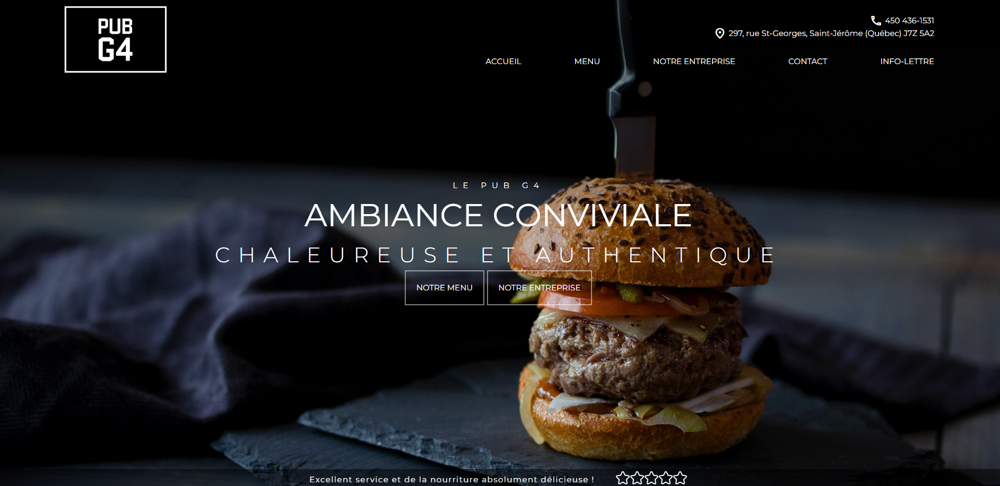
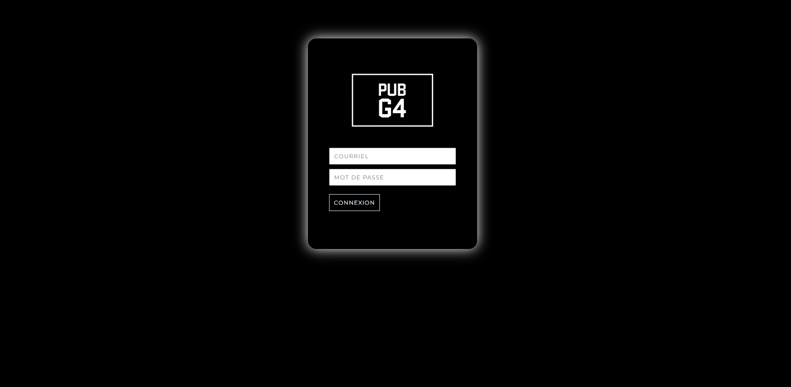

LIVE DEMO : http://0479854.cpsw-fcsei.com/projetweb1/

# ACCES A LA PARTIE ADMINISTRATIVE DU SITE
## Comment se connecter en tant qu'admin :

- Installer la base de donnée.
- Créez une BDD vide et importez le script fourni.
- Ajouter "/connexion" a la fin de l'URL pour accéder au formulaire de connexion.

### LES COMPTES
- Gaston (Admin)
    - gastonleclient@pubg4.com
    - MOT DE PASSE : pubg4123

- Dan (Employé)
    - dan@gmail.com
    - MOT DE PASSE : 1234

